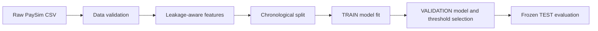
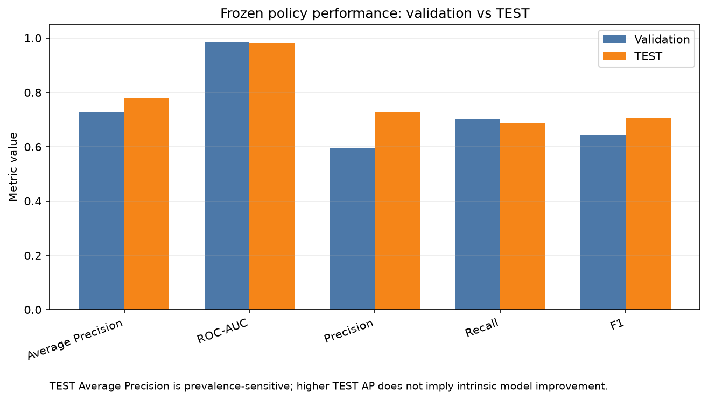
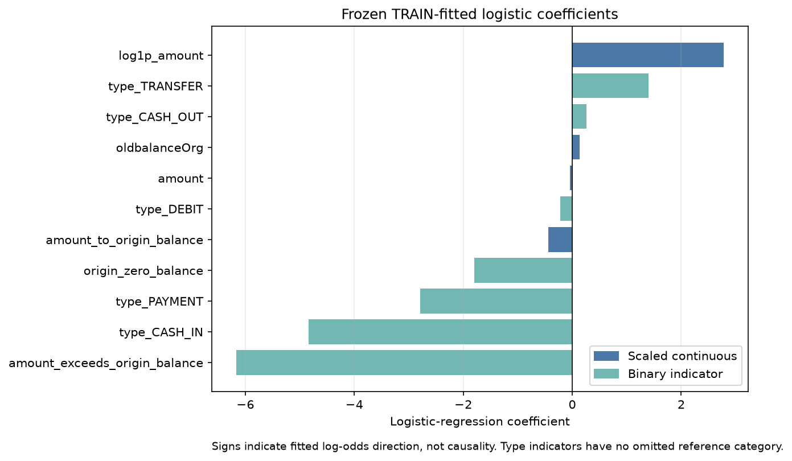

# Explainable Fraud Risk Engine

An end-to-end portfolio project for building, validating, and documenting an
explainable fraud-risk model on simulated PaySim transaction data. The project
emphasises leakage control, chronological evaluation, transparent features, and a
frozen validation-selected operating policy.

The modelling lifecycle is complete through Phase 6B. The final out-of-time TEST
result is historical and must not be rewritten by later portfolio extensions.

## Problem

Fraud detection is a highly imbalanced classification problem: most transactions
are legitimate, so accuracy alone can look strong while fraud is missed. A useful
fraud-review model must balance fraud capture against false alerts because every
alert can consume analyst time.

Offline fraud modelling also has a leakage risk. Features that are known only
after a transaction, or modelling choices made after seeing final holdout
performance, can make results look more credible than they would be in a real
forward-scoring workflow. This project therefore evaluates forward in time using
a chronological split instead of a random split.

## Dataset

The project uses PaySim-style simulated transaction data. The raw CSV is not
committed to this repository; place it at:

```text
data/PS_20174392719_1491204439457_log.csv
```

Repository documentation records the observed dataset facts used during this
portfolio build, including 6,362,620 rows, 8,213 fraud transactions, and an
overall fraud rate of 0.129082%. Because PaySim is simulated, the final results
are portfolio evidence for modelling discipline and communication, not claims of
real-bank production performance.

## Approach

1. Validate the raw PaySim schema and core data-quality rules.
2. Explore class imbalance, transaction types, amounts, balances, identifiers,
   and the existing `isFlaggedFraud` rule benchmark.
3. Build a conservative leakage-aware feature matrix.
4. Split whole chronological `step` values into TRAIN, VALIDATION, and TEST.
5. Compare prior, rule-based, unweighted logistic, and class-weighted logistic
   baselines on VALIDATION.
6. Select a demonstration threshold on VALIDATION only.
7. Run the final out-of-time TEST evaluation once using the frozen policy.



## Results at a glance

Frozen model policy: unweighted logistic regression, `class_weight=None`,
preprocessing fitted on TRAIN only, model fitted on TRAIN only, no
train+validation refit.

Frozen validation-selected threshold: `0.02895689437774259`

| Final TEST metric | Value |
|---|---:|
| Average Precision | 0.780443 |
| ROC-AUC | 0.982586 |
| Precision | 72.59% |
| Recall | 68.68% |
| F1 | 0.705809 |
| Alerts | 1,565 |
| Alert rate | 1.2664% |



At the frozen threshold, the final TEST confusion counts were 1,136 true
positives, 429 false positives, 121,497 true negatives, and 518 false negatives.
The threshold is a validation-selected demonstration policy, not an optimal,
economically optimal, profit-maximising, or production-ready bank threshold.

The `isFlaggedFraud` TEST benchmark had precision `1.000000` but recall only
`0.004837`, detecting 8 of 1,654 fraud cases.

## Explainability

Explainability in this project comes from a deliberately small and auditable
modelling design:

1. The feature set is transparent and limited to 11 transaction-level features.
2. Feature availability and leakage risk are documented before modelling.
3. Logistic-regression coefficient direction can be inspected.
4. Threshold trade-offs are documented explicitly on VALIDATION.
5. Final results are auditable through committed JSON artifacts.



A positive coefficient means the fitted model assigns higher log-odds of fraud,
holding other features fixed. A negative coefficient means lower fitted log-odds.
Continuous-feature coefficients refer to one-standard-deviation changes after
TRAIN-fitted scaling. Non-type binary-feature coefficients refer to changing an
indicator from 0 to 1. Transaction type needs a separate caveat: all five
mutually exclusive type indicators are retained with the intercept, so there is
no omitted reference category. Type coefficients are best read through relative
category contrasts, not as standalone baseline-relative effects. Coefficients
are associations within the fitted model, not causal effects, and correlated
features such as `amount` and `log1p_amount` complicate isolated interpretation.

## Why the evaluation is credible

- The split is chronological: TRAIN steps `1-446`, VALIDATION steps `447-594`,
  and TEST steps `595-743`.
- Whole `step` values stay together, avoiding cross-partition leakage within a
  shared timestamp-like group.
- The feature contract excludes post-transaction balances, identifiers,
  destination balance information, the target, the benchmark rule, and `step`.
- Preprocessing was fitted on TRAIN only.
- The model was fitted on TRAIN only.
- The model was chosen on VALIDATION using Average Precision as the predefined
  primary metric.
- The threshold was chosen on VALIDATION only.
- TEST was used once for final model-performance evaluation.
- No post-TEST tuning occurred.

Accurate test-seal wording: TEST was not used for preprocessing fitting, model
fitting, model selection, threshold selection, or model-performance evaluation
before Phase 6B. Earlier phases documented split-level TEST row counts and
prevalence, so the project does not claim TEST labels were literally never
observed anywhere.

## Feature set

The final model uses exactly 11 features:

1. `amount`
2. `log1p_amount`
3. `oldbalanceOrg`
4. `origin_zero_balance`
5. `amount_exceeds_origin_balance`
6. `amount_to_origin_balance`
7. `type_CASH_IN`
8. `type_CASH_OUT`
9. `type_DEBIT`
10. `type_PAYMENT`
11. `type_TRANSFER`

Excluded from `X`: `isFraud`, `isFlaggedFraud`, raw identifiers, both
post-transaction origin balances, destination balance information, and `step`.
The `step` field is used only for chronological splitting.

## Repository structure

```text
src/fraud_engine/      Reusable data, feature, split, modelling, and evaluation code
scripts/               Reproducible workflow entry points
tests/                 Unit and contract tests
docs/                  Decisions, feature availability, EDA findings, interview notes
reports/eda/           EDA notes and generated EDA figures
reports/modeling/      Validation, threshold, and final TEST artifacts
data/                  Dataset guidance; raw PaySim CSV is ignored
```

## Reproducibility

Create and activate an environment:

```powershell
python -m venv .venv
.\.venv\Scripts\Activate.ps1
python -m pip install --upgrade pip
python -m pip install .[dev]
```

Run local quality checks:

```powershell
python -m ruff check src tests scripts
python -m pytest -q
```

Provide the raw PaySim CSV at:

```text
data/PS_20174392719_1491204439457_log.csv
```

Run historical workflows:

```powershell
python scripts/run_eda.py data/PS_20174392719_1491204439457_log.csv
python scripts/run_validation_baselines.py data/PS_20174392719_1491204439457_log.csv
python scripts/run_threshold_analysis.py data/PS_20174392719_1491204439457_log.csv
python scripts/create_portfolio_figures.py
```

FINAL EVALUATION ALREADY EXECUTED:

```powershell
python scripts/run_final_test_evaluation.py data/PS_20174392719_1491204439457_log.csv
```

The final TEST runner is preserved for auditability and reproducibility of the
historical result. It should not be casually rerun as another tuning loop, and
its output must not be used to change the frozen model, features, preprocessing,
threshold, or hyperparameters.

## Reports and artifacts

- `reports/modeling/validation_results.json`: Phase 5 validation baselines.
- `reports/modeling/threshold_analysis.json`: Phase 6A validation threshold
  analysis and frozen threshold policy.
- `reports/modeling/test_results.json`: Phase 6B final out-of-time TEST result.
- `reports/modeling/model_explainability.json`: descriptive coefficient
  explainability for the frozen TRAIN-fitted logistic configuration.
- `reports/modeling/figures/`: validation precision-recall, ROC, and threshold
  trade-off figures, plus portfolio result and coefficient visuals.
- `reports/eda/figures/`: exploratory class, type, amount, balance, and benchmark
  visuals.

The JSON artifacts are the source of truth for exact metric values.

## Limitations

- PaySim is simulated transaction data.
- The model is intentionally simple and uses a conservative 11-feature contract.
- The project does not claim real-bank production performance.
- No business-specific analyst capacity, false-positive cost, or false-negative
  cost matrix was available.
- The threshold is a demonstration policy selected from validation trade-offs.
- Temporal distribution shift exists across TRAIN, VALIDATION, and TEST periods.

## Future portfolio extensions

Future work should be clearly separated from the frozen historical model result.
Useful extensions include:

- descriptive explainability for the frozen logistic model and feature set
- monitoring and drift design
- a lightweight results dashboard
- an optional agentic investigation assistant that uses frozen outputs

Future work must not rewrite the historical TEST result or reopen model
selection, threshold selection, feature engineering, preprocessing, or
hyperparameter tuning.

## Development history

- Phase 0: repository scaffold, packaging, CI, and data guidance.
- Phase 1: PaySim ingestion and validation.
- Phase 2: exploratory data analysis and figures.
- Phase 3: leakage-aware 11-feature baseline matrix.
- Phase 4: chronological whole-step train/validation/test split.
- Phase 5: validation baselines with Average Precision as the primary metric.
- Phase 6A: validation-only threshold analysis and frozen demonstration policy.
- Phase 6B: one-time final out-of-time TEST evaluation.
